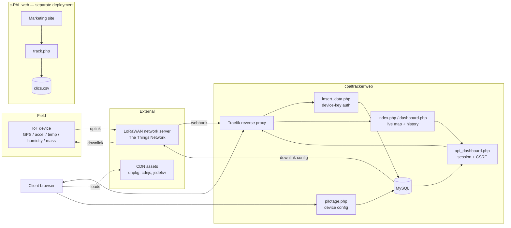

# Architecture

Single reference for what c-PAL's software does and how it's built. Covers
[KAN-47](https://c-pal.atlassian.net/browse/KAN-47)
([project-bootstrap.md, 1.2](https://github.com/fmguimaraes/cto-tools/blob/main/docs/project-bootstrap.md)).

No Confluence or other prior-art doc was found to source the objective from;
the summary below is inferred from the codebase (commercial site content,
`cpaltracker.web` source comments) and should be corrected by whoever holds
that context.

## Objective and context

c-PAL tracks sensitive physical shipments (its commercial site advertises
aeronautics, nuclear and pharma sectors) with IoT sensor devices attached to
the goods. Devices report position and condition in transit — GPS location,
shock/acceleration, ambient and internal temperature, humidity, mass — so a
client can see where a shipment is and whether it stayed within safe
handling conditions.

**`cpaltracker.web`** is the target system this doc centers on: it is the
product (device data ingestion + the client-facing tracking/dashboard app).
The other repos are supporting pieces, not part of its runtime.

## Components

| Repo | Role | Stack |
|---|---|---|
| `cpaltracker.web` | **Primary system.** Ingests device readings, authenticates clients, serves the live map and history dashboard, lets MAIN-contract clients configure devices. | PHP 8 (`declare(strict_types=1)`), MySQL via PDO, server-rendered pages + vanilla JS; Leaflet (map) and Chart.js (charts) loaded from CDN (unpkg / cdnjs, jsdelivr fallback). Session-based auth, re-checked against the DB on every request. Runs behind a Traefik reverse proxy (TLS terminated upstream; app trusts `X-Forwarded-Proto` only because Traefik is the sole trusted proxy). |
| `c-PAL.web` | Commercial/marketing site. Independent deployment — does not read or write `cpaltracker.web`'s data. | Static HTML/CSS/JS, one small PHP endpoint (`track.php`) appending click events to a local CSV. |
| `cto-tools` | Shared engineering process: Jira automation scripts, SDLC/code-standards docs, Claude Code skills and hooks. Dev-time only, not deployed. | Python (Jira scripts), Markdown. |
| `cpal.docs` | Documentation — single source of truth for specs, requirements and process (this doc included). | Markdown. |
| `cpal.global` | Umbrella repo; pins the above as git submodules, holds shared `.env` and cross-cutting config. | — |

## How the pieces connect

External dependencies: the LoRaWAN network server (device uplink/downlink),
and CDN-hosted frontend libraries (Leaflet, Font Awesome, Chart.js) — both
single points of failure for live data and dashboard rendering respectively
if unreachable.

## Source of truth

This page lives in `cpal.docs/architecture/` and is linked from
[`cpal.docs/README.md`](../README.md). Keep it current when a component,
stack choice or external dependency changes; it is the one place this
overview is written, per [`sdlc/README.md`](../sdlc/README.md#single-source-of-truth-cpaldocs).
